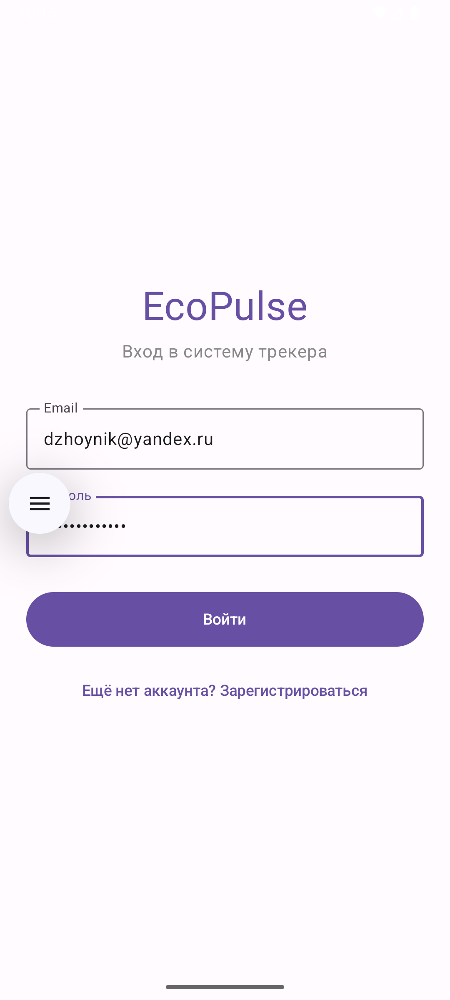
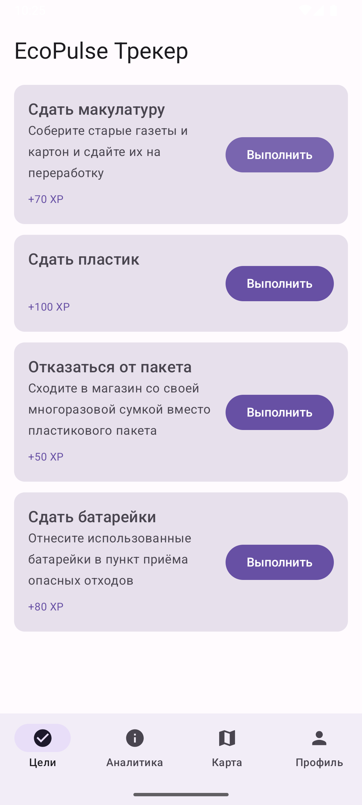
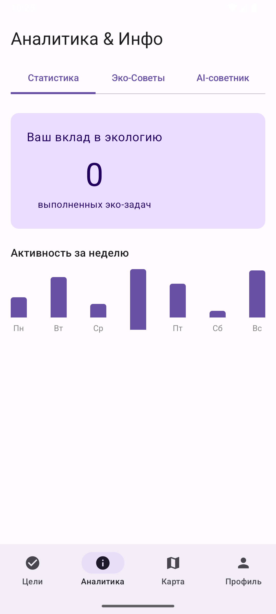
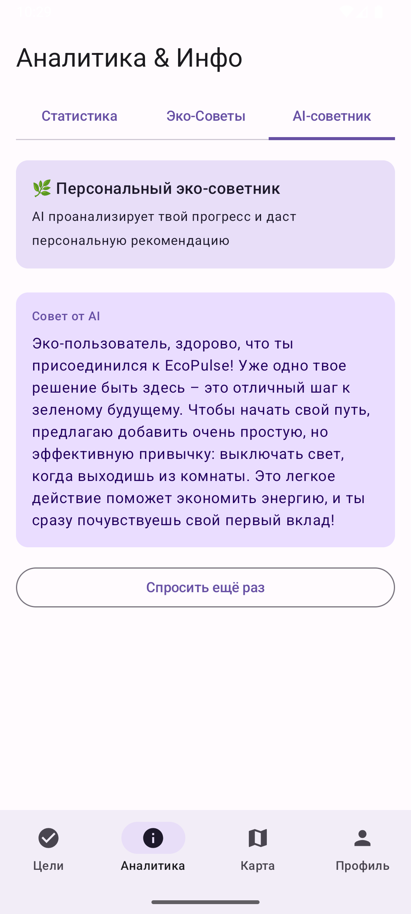
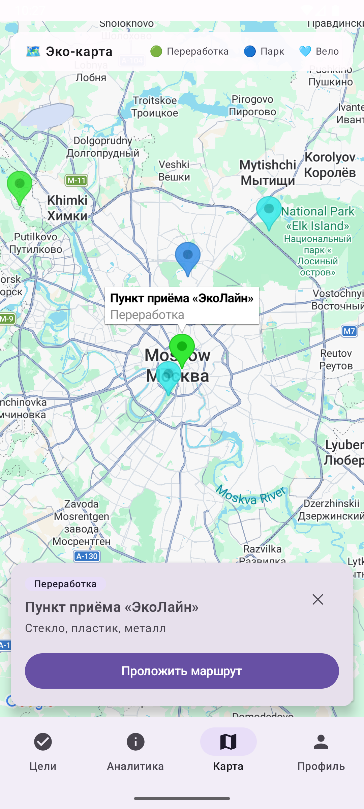
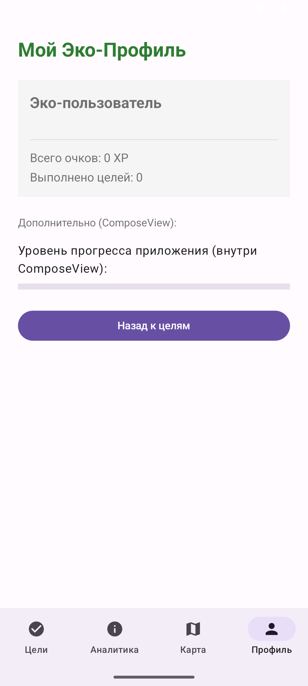

# 🌿 EcoPulse

Android-приложение для формирования экологичных привычек: пользователь выполняет эко-цели, копит очки и уровень, читает советы, смотрит карту эко-точек города и получает персональную рекомендацию от ИИ на основе своего прогресса.

Проект построен на **чистой архитектуре** с разбивкой на три Gradle-модуля, использует **Jetpack Compose**, **Hilt**, **WorkManager**, **Firebase** (Firestore + FCM + Crashlytics), **Google Maps** и **Gemini API**.

---

## 📋 Содержание

- [Скриншоты](#-скриншоты)
- [Возможности](#-возможности)
- [Архитектура](#-архитектура)
- [Стек технологий](#-стек-технологий)
- [Структура проекта](#-структура-проекта)
- [Сборка и запуск](#-сборка-и-запуск)
- [Варианты сборки](#-варианты-сборки-flavors--buildtypes)
- [Соответствие критериям оценки](#-соответствие-критериям-оценки)

---

## 📱 Скриншоты

Скриншоты лежат в папке [`screenshots/`](screenshots/).

| Авторизация | Цели | Статистика |
|:---:|:---:|:---:|
|  |  |  |

| AI-советник | Карта | Профиль |
|:---:|:---:|:---:|
|  |  |  |

---

## ✨ Возможности

- **Эко-цели** — список целей из Firestore с live-обновлением; выполнение цели начисляет очки и увеличивает счётчик.
- **Аналитика** — три вкладки: «Статистика», «Эко-Советы» и «AI-советник».
- **AI-советник** — Gemini анализирует профиль пользователя (очки, выполненные цели, прогресс уровня) и выдаёт персональный совет на русском языке.
- **Карта эко-точек** — пункты приёма вторсырья, парки и велодорожки на Google Maps с выбором точки и описанием.
- **Профиль** — экран, собранный из XML-разметки (ViewBinding), внутрь которой встроен `ComposeView` с прогресс-баром уровня.
- **Фоновая синхронизация** — периодическая задача WorkManager раз в сутки при наличии сети и зарядки.
- **Уведомления** — push через Firebase Cloud Messaging + локальное уведомление при отключении зарядного устройства.

---

## 🏛 Архитектура

Проект следует принципам **Clean Architecture**. Зависимости направлены строго внутрь: `app → data → domain`, при этом `domain` не знает ни о Android, ни о Firebase.

```
┌─────────────────────────────────────────────┐
│  :app  (presentation + DI)                    │
│  Compose-экраны, ViewModel, Hilt-модули,      │
│  WorkManager, FCM Service, Maps               │
└───────────────┬───────────────────────────────┘
                │ зависит от
        ┌───────┴────────┐
        ▼                ▼
┌───────────────┐   ┌───────────────────────────┐
│   :data       │   │        :domain             │
│ Repository    │──▶│  Модели (EcoGoal,          │
│ Impl, Firestore│  │  UserProfile, EcoTip),     │
│ DTO + Mapper, │   │  интерфейс EcoRepository,  │
│ Worker,        │  │  Use Case'ы                │
│ Receiver      │   │  (чистый Kotlin, без       │
└───────────────┘   │   Android-зависимостей)    │
                    └───────────────────────────┘
```

**Слои:**

- **domain** — `java-library` (чистый Kotlin, только coroutines-core). Содержит модели предметной области, интерфейс репозитория `EcoRepository` и Use Case'ы: `GetEcoGoalsUseCase`, `GetUserProfileUseCase`, `CompleteGoalUseCase`, `GetEcoTipsUseCase`.
- **data** — реализация `EcoRepositoryImpl` поверх Firestore, DTO-сущности (`EcoGoalEntity`, `UserProfileEntity`) с маппингом `Entity → Domain` (`EcoMapper`), фоновые `EcoSyncWorker` и `PowerConnectionReceiver`.
- **app** — Compose-UI, `ViewModel`-слой (`StateFlow`), навигация, Hilt-модули, FCM-сервис, интеграция Maps и Gemini.

**DI:** Hilt. `DataModule` (SingletonComponent) предоставляет репозиторий, `DomainModule` (ViewModelComponent) — Use Case'ы.

---

## 🧰 Стек технологий

| Категория | Технологии |
|---|---|
| Язык / JVM | Kotlin 2.0.0, JDK 17 |
| UI | Jetpack Compose (BOM 2024.02.02), Material 3, Navigation Compose |
| Совместимость | XML + ViewBinding + `ComposeView` / `AndroidView` |
| DI | Hilt 2.51.1 |
| Асинхронность | Coroutines, Flow / StateFlow |
| Фон | WorkManager 2.9.0, BroadcastReceiver, FirebaseMessagingService |
| Backend | Firebase Firestore, Cloud Messaging, Crashlytics, Analytics |
| ИИ | Gemini API (`generativeai` 0.9.0, модель `gemini-2.5-flash`) |
| Карты | Google Maps SDK + `maps-compose` |
| Сериализация | kotlinx.serialization |
| minSdk / target / compile | 31 / 36 / 36 |

---

## 📂 Структура проекта

```
Ecopulse/
├── app/                  # Презентационный слой + DI
│   ├── src/main/java/.../presentation/   # auth, goals, stats, map, profile, navigation, theme
│   ├── src/main/java/.../di/             # DataModule, DomainModule
│   ├── src/main/java/.../service/        # EcoPulseFcmService
│   ├── src/main/res/layout/              # fragment_profile.xml (XML + ComposeView)
│   ├── proguard-rules.pro
│   └── build.gradle.kts
├── data/                 # Репозиторий, Firestore, Worker, Receiver, мапперы
│   ├── consumer-rules.pro
│   └── build.gradle.kts
├── domain/               # Чистый Kotlin: модели, Use Case'ы, интерфейс репозитория
│   └── build.gradle.kts
├── screenshots/          # Скриншоты для README
├── build.gradle.kts
└── settings.gradle.kts
```

---

## 🚀 Сборка и запуск

### 1. Требования
- Android Studio (актуальная версия), JDK 17, Android SDK 36.

### 2. Секреты — `local.properties`
Файл **не коммитится** (в `.gitignore`). Создайте его из `local.properties.example` и заполните:

```properties
sdk.dir=/путь/к/Android/Sdk
GEMINI_API_KEY=ваш_ключ_gemini
MAPS_API_KEY=ваш_ключ_google_maps
```

> Ключи читаются в `app/build.gradle.kts` функцией `secret()` именно из `local.properties` (Gradle сам этот файл в project-свойства не загружает).

### 3. Firebase
Положите свой `google-services.json` в `app/`. В Firestore создайте коллекции:
- `users` — документ `user_77` (создаётся автоматически при первом запуске, если отсутствует);
- `goals` — документы с полями `goalId`, `titleText`, `subDescription`, `rewardAmount`, `statusCompleted`.

### 4. Google Maps
Ключ Maps должен быть авторизован под **реально запускаемый пакет**. Из-за flavor + suffix это, например, `com.example.ecopulse.free.debug` (а не `com.example.ecopulse`). В ограничениях ключа добавьте этот package + debug-SHA-1, либо на время теста снимите ограничения.

### 5. Gemini
Для бесплатного использования создайте ключ в [Google AI Studio](https://aistudio.google.com/apikey) — он бесплатный и сразу ограниченный. Используемая модель — `gemini-2.5-flash` (есть бесплатная квота). При нулевой квоте можно переключиться на `gemini-2.5-flash-lite`.

### 6. Запуск
```bash
./gradlew assembleFreeDebug      # debug-сборка бесплатного флавора
./gradlew assembleFreeRelease    # release c R8/обфускацией
```

### 7. Release-подпись (опционально)
Скопируйте `keystore.properties.example` → `keystore.properties` (в `.gitignore`) и заполните путь и пароли. Если файла нет — release подписывается debug-ключом, сборка не падает.

---

## ⚙️ Варианты сборки (flavors / buildTypes)

**buildTypes:**
- `debug` — `applicationIdSuffix = ".debug"`, `isDebuggable = true`.
- `release` — `isMinifyEnabled = true`, `isShrinkResources = true` (R8 + сжатие ресурсов), правила в `proguard-rules.pro` и `consumer-rules.pro`.

**productFlavors** (измерение `version`):

| Flavor | applicationId suffix | app_name | `IS_PREMIUM` |
|---|---|---|---|
| `free` | `.free` | EcoPulse Free | `false` |
| `premium` | `.premium` | EcoPulse Pro | `true` |

Итоговые комбинации: `freeDebug`, `freeRelease`, `premiumDebug`, `premiumRelease`.

---

## ✅ Соответствие критериям оценки

### Обязательные (30 баллов)

| Критерий | Как реализовано |
|---|---|
| **Чистая архитектура + DI** (8) | 3 модуля (`app`/`data`/`domain`); `domain` — чистый Kotlin без Android; Use Case'ы, интерфейс репозитория в domain + реализация в data, маппинг DTO→Domain (`EcoMapper`); зависимости направлены внутрь; DI на Hilt. |
| **Фоновые задачи** (6) | `PeriodicWorkRequest` (24 ч) с `Constraints` (сеть + зарядка), `enqueueUniquePeriodicWork(KEEP)`; `PowerConnectionReceiver` (BroadcastReceiver) + `EcoPulseFcmService` (Service) с корректным жизненным циклом. |
| **Анимации Compose** (4) | `animateColorAsState` + `tween` (цвет карточки цели), `animateContentSize` и `AnimatedVisibility` (раскрытие блоков, оверлей карты). |
| **XML + Compose** (4) | `ProfileScreen` через `AndroidView` инфлейтит `fragment_profile.xml` (ViewBinding), внутри которого `ComposeView` с прогресс-баром — двунаправленная интеграция. |
| **Gradle: сборки** (4) | `debug`/`release` (R8 + shrinkResources), 2 флавора `free`/`premium` с реальными отличиями (`applicationId`, `app_name`, флаг `IS_PREMIUM`). |
| **Качество кода и UX** (4) | Состояния загрузки и ошибок через sealed-классы, обработка исключений с отправкой в Crashlytics, осмысленный пользовательский сценарий. |

### Бонусные

| Бонус | Как реализовано |
|---|---|
| **Firebase** (+3) | Firestore как основное хранилище (live-обновления через `callbackFlow`) + FCM push — 2 из 3. |
| **ИИ** (+3) | Gemini встроен органично: промпт формируется из данных профиля пользователя, ответ — персональный эко-совет. |
| **Внешний сервис** (+2) | Google Maps SDK + `maps-compose` с реальными эко-точками. |
| **Крашлитика** (+1) | Firebase Crashlytics: кастомные события (`ai_advice_success`, `eco_goals_loaded`) и handled-ошибки (`recordException`). |

---

## 📝 Заметки

- `local.properties`, `keystore.properties`, `*.jks` — в `.gitignore`, секреты в репозиторий не попадают.
- На Android 13+ объявлено разрешение `POST_NOTIFICATIONS`; для гарантированного показа уведомлений его нужно запрашивать в рантайме.
- `PowerConnectionReceiver` слушает `ACTION_POWER_DISCONNECTED`; на API 26+ такой неявный broadcast надёжнее регистрировать в рантайме через `Context.registerReceiver`.
